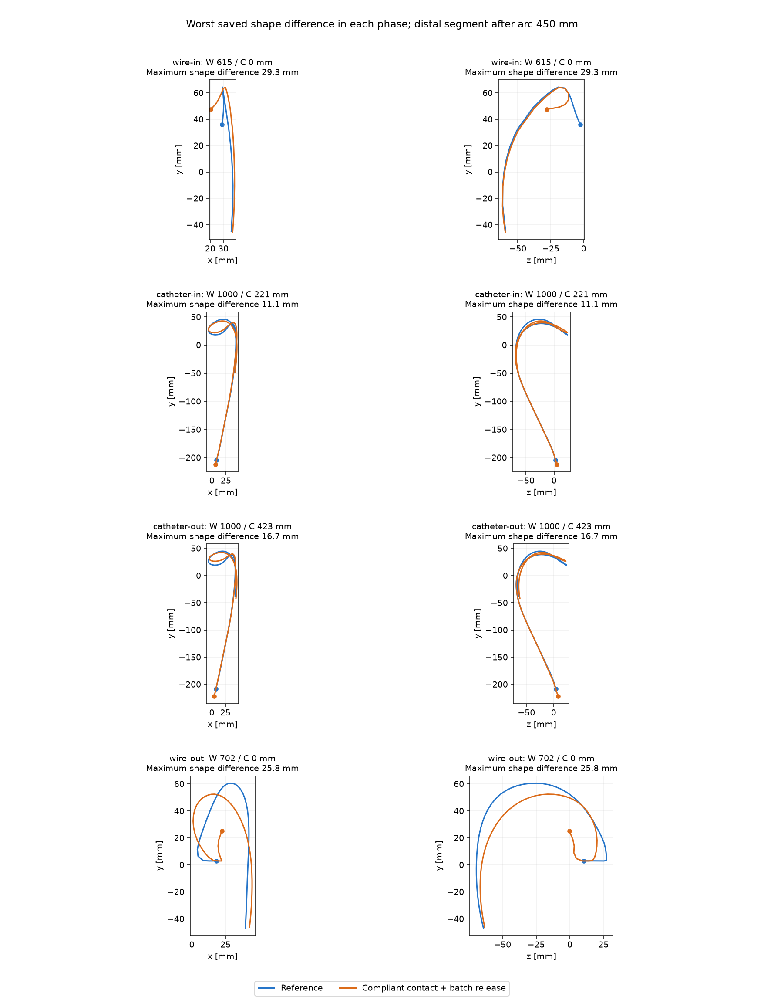

# Experimental compliant normal contacts and simultaneous release

An opt-in physical approximation, **not enabled by the app factory**. Reference Kirchhoff/adaptive behavior remains available and unchanged by default. This is progress toward the complete 60 Hz goal, not completion.

## Model and solver

For vessel witnesses only, use `g + C lambda >= 0`, `lambda >= 0`, and complementary reaction. Physical penetration is `-g`, never the compliant residual. Elastic energy is `C lambda² / 2`; active KKT rows gain the dual diagonal `C`. Length, sheath and bend constraints remain rigid. Positive compliance makes otherwise parallel contact equations independent. Projection uses the compliant constraint at fixed physical reaction. Failed/cancelled attempts restore the previous compliance setting along with the physical state.

`wallCompliance=1e-6` allows a small normal indentation under load. This is a spring model, not a numerical regularization that claims exact hard-wall equivalence. Incremental/modified Newton research paths are explicitly unsupported with positive compliance.

`simultaneousContactRelease=true` updates the private active set by releasing all negative target reactions together. Final stationarity/complementarity checks and the single-pivot fallback remain mandatory. `batchActivationSize=64` permits larger activation groups. Defaults remain zero compliance, ordinary release, and batches of eight.

## Complete Node cycles

Every run completed all 5757 movement steps: wire 0→1000 mm, catheter 0→1000 mm, catheter back to zero, then wire back to zero; dt 1/60 s, identical feed speeds and material profiles. Timings exclude rendering/UI.

| Metric | Retained reference | Compliance alone | Compliance + simultaneous release |
|---|---:|---:|---:|
| Mean ms | 33.915 | 35.498 | 30.980 |
| P95 ms | 93.964 | 92.179 | 75.512 |
| Maximum ms | 1612.864 | 2206.167 | 2583.079 |
| Steps over 16.67 ms | 4006 | 4036 | 3959 |
| LU factorizations | 87269 | 97253 | 69607 |
| Newton iterations | 20741 | 23718 | 23312 |
| Full assemblies | 32058 | 35550 | 34686 |
| Residual assemblies | 40185 | 46661 | 45143 |

Combined variant reduces LU by 20.2% and mean time by 8.7%, but increases Newton/assembly work and worsens maximum latency. Keep as an experimental option, not a default upgrade. Its worst step is index 1464, wire 1000 mm / catheter 86.67 mm: 121 Newton iterations, 1454 LU, 2.583 s. Incoming replay is archived.

On the same difficult incoming reference state (step 1144), reference 913 LU / 58 Newton becomes 180 / 13 with compliance and 144 / 13 with simultaneous release. The other two saved states change 38→30 and 397→255 LU when release is enabled. Larger activation alone did not change that first result. Rigid contacts with simultaneous release were worse on that state (1095 LU / 57 Newton).

## Physical checks and limits

All accepted states finite; maximum relative length error 3.48e-8; final force/friction residual bound below 1e-4. The maximum sampled geometric indentation is **0.04007 mm**, deliberately nonzero. Independent continuous capsule audit on 96 snapshots reaches **0.14428 mm** versus reference **0.10964 mm**; discrete samples miss some between-sample overlap. Zero exact axis intersections in saved snapshots, zero far-outside or out-of-bounds warnings in 52,036 packed-lumen samples. These are spatial snapshot checks, not swept collision proof.

Shape RMS by phase: 2.65 / 4.12 / 7.17 / 6.30 mm; maximum local differences 29.30 / 11.14 / 16.65 / 25.80 mm. Inspected the worst saved shape from each phase in two projections: both follow the arch and form/withdraw a distal loop, with different bending timing and loop position. Peak speed 284.03 mm/s versus reference 259.17. Full real-time visual/browser validation is still outstanding.



## Validation and reproduction

74 targeted regression tests passed (normal-spring equilibrium including parallel contacts, fixed supports, simultaneous release, rollback, genuine penetration reporting, original rows/matrices, active bases, replayed closed-root failure, geometry protection and app transactions). Vite build passed. A post-test row-shape compatibility fix omits the optional compliance field on original hard rows; the same hard incoming replay still gives exactly 144 LU / 13 Newton.

```sh
OPTIONS='{"wallCompliance":0.000001,"batchActivationSize":64,"simultaneousContactRelease":true}' node scripts/physics/profile-shared-axis-full-cycle.mjs /tmp/oet-compliant-cycle
```

No new browser full-cycle measurement has been claimed. Stable full-cycle 60 Hz is not established.
