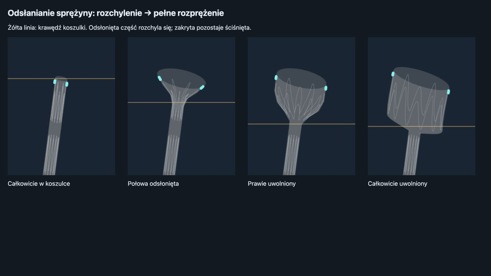

# Stronger partial ring opening — 2026-09-27

The uncovered proximal ring end now approaches its expanded radius while the distal end stays packed inside the delivery sleeve. The retained-ring radial envelope rises to 85% (previously 5%) by half-band exposure, with a 6 mm smooth transition at the sleeve lip. The final expansion still uses the committed-time whole-band spring after the trailing end clears. These are reduced simulator parameters, not measured device material properties.

Broader opening exposed a discontinuity in branch separation: an axial cutoff switched septum projection on/off as flared vertices crossed an end plane, causing up to 5.82 mm jumps for a 0.2 mm sleeve step in the left-access regression. The separator now continues through clamped end-section samples. Existing bounded-motion, ring-separation and wire-length regressions pass without relaxed tolerances.

Verification:
- 53/53 tests passed: sewn release, deployment, bifurcation stability, limb threading and ring kinematics (17.73 s).
- Added assertions for substantial upper expansion at half release, a taper toward the sleeve lip, and an unchanged packed bottom radius.
- Left and right mechanical sequences retain strict lumen containment checks during release and introducer withdrawal.
- Production build passed (4.91 s; existing large-chunk warning).
- Browser rendering checked for packed, half uncovered, almost free and fully released stages, using actual simulator geometry.

