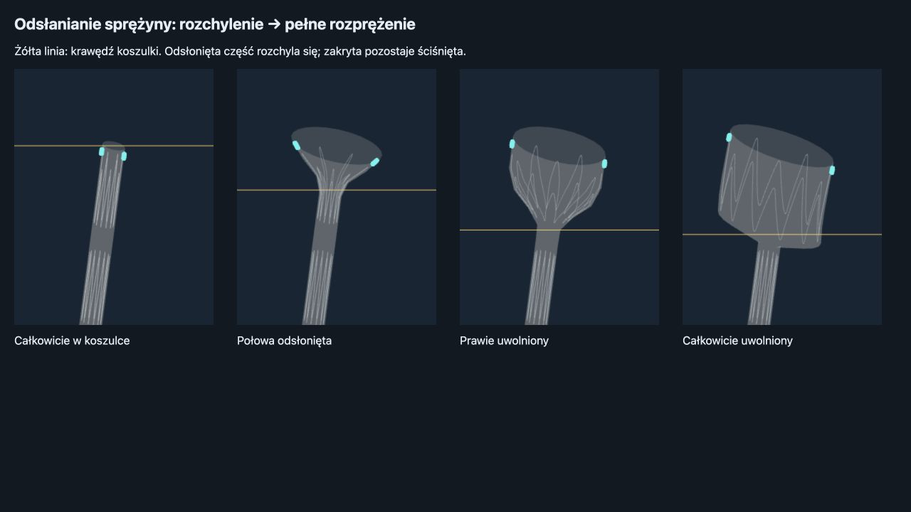

# Regular metal arms during release — 2026-09-27

Changed the shared wire-wave profile from a full-arm cosine to nearly straight middle sections with rounded crowns. The middle 70% of each half-wave now has constant slope in the unwrapped ring coordinates; the end 15% on each side retains continuous tangents. This reduces broad transverse loops while preserving the existing proximal M pattern and radial opening envelope.

The nominal wire length and the release arc-length solve use the same profile. Folded preview, released rings and catalogue miniatures share it. This is a geometric refinement of the reduced simulator model, not a new nitinol material solver. It does not solve arbitrary ovalization under vessel contact.

Validation:
- 53/53 tests passed: deployment, sewn release, bifurcation stability, ring kinematics and limb threading (16.90 s).
- Existing strict wire-length, ring-separation and mechanical lumen-containment tolerances unchanged.
- Build passed (4.34 s; existing bundle-size warning).
- Browser preview checked at packed, half uncovered, almost released and fully released states.

