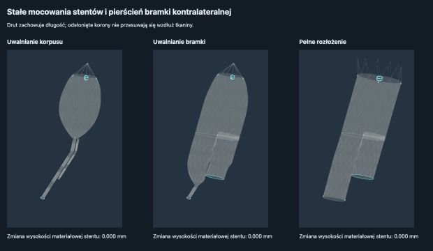

# Stałe mocowania stentów i znacznik bramki — 2026-09-27

## Przyczyna

Poprzedni marker bramki kontralateralnej był jednym krótkim odcinkiem, a nie pierścieniem. Poprzednie zachowanie długości drutu zmieniało wysokość materiałową stentu podczas uwalniania: nominalne 8 mm spadało w częściowych konfiguracjach do około 4 mm. Powstawały przez to sztucznie duże szczeliny między stentami, które znikały po rozprężeniu.

## Zmiana

Przywrócono cienki, zamknięty znacznik końca bramki (96 połączonych odcinków, promień drutu 0,12 jednostki modelu). Odsłonięte korony zachowują stałe współrzędne na tkaninie. Kształt drutu pomiędzy koronami dopasowuje się z zachowaniem całkowitej długości pierścienia. Ograniczenia tkaniny ograniczają nadmierne rozciąganie wzdłużne i rozdzielenie koron. Chwilowe wgniecenia kontaktowe nie nadpisują bazowej geometrii uwalniania.

To model przybliżony: kontroluje całkowitą długość pierścienia, nie osobno długość każdego ramienia. Całkowicie schowane stenty nadal korzystają z przybliżenia fałdowania. Nie jest to pełny model powłokowy tkaniny ani walidacja IFU rozmieszczenia markerów.

## Weryfikacja

62 testy przeszły: RingKinematics, Capture, SewnRelease, SewnAnchors, Rotation, Interaction, WallFit, Expansion, LimbThreading oraz contrastGraftAnatomy. Build Vite przeszedł; pozostało dotychczasowe ostrzeżenie o dużym pakiecie. Nowy test kontroluje stałe mocowania po obu dostępach podczas uwalniania i rotacji, długość drutu oraz ciągłość i położenie pierścienia. Sprawdzono też podgląd trzech etapów w przeglądarce, bez błędów konsoli.

## Koszt

Ograniczenia są buforowane i pomijane dla niezmienionej lub całkowicie zakrytej geometrii. Dodatkowe projekcje podczas aktywnego uwalniania zwiększają koszt. Pomiary pomocnicze 90 aktualizacji były zmienne (około 14–27 ms/aktualizację nowej wersji; wcześniejszy pojedynczy pomiar starej wersji około 8 ms), wykonywane na obciążonym komputerze. Nie stanowią porównywalnego benchmarku Hz fizyki i nie potwierdzają braku regresji wydajności. Należy osobno profilować aktywne uwalnianie w pełnej scenie.

