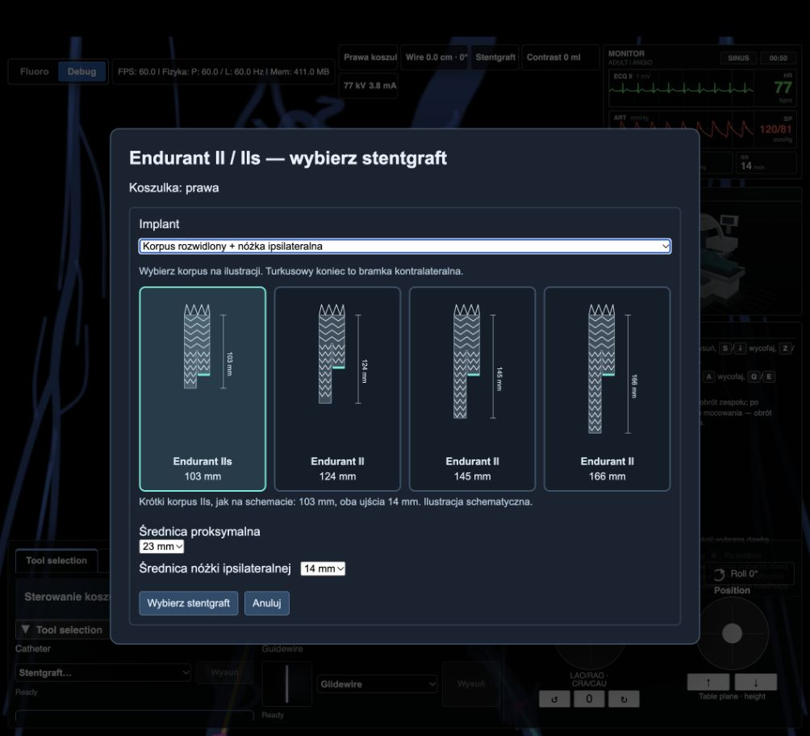

# Uwalnianie pierścieni i kontakt na bifurkacji — 27.09.2026

## Zmiana

Pierwszy wybór korpusu w oknie narzędzi to Endurant IIs, 23 mm. Kolejny wybór zachowuje wcześniej wskazany, poprawny rozmiar.

Każdy pierścień ma osobny stan uwolnienia, wspólny dla całego pasa metalu. Pozostaje zaciśnięty do odsłonięcia całego pasa, po czym rozpręża się także przy zatrzymanej koszulce. Ostatni pierścień czeka na odsłonięcie końca nóżki. Dotyczy to obu odnóg korpusu i osobnej nóżki. Czas rozprężania jest liczony wyłącznie z zatwierdzonego czasu symulacji.

Miejsca przyszycia pierścieni są stałymi współrzędnymi tkaniny. Ograniczenie długości odcinków osi eliminuje wielokrotne rozciąganie odstępów pomiędzy sąsiadami. W teście obu dostępów odległość środków sąsiednich pierścieni nie przekracza 110% rozstawu materiałowego. Jest to ograniczony model geometryczny tkaniny, nie pełny model powłokowy. Zachowany jest dotychczasowy warunek stałej długości drutów.

Przegroda rozdziela otwierające się odnogi. Uwolniona tkanina nie dziedziczy kolejnych oscylacji zakrytej części urządzenia. Prędkość ruchu powierzchni jest ograniczona w czasie symulacji, aby uwolnienie pierścienia nie przesuwało ściany o kilka milimetrów w jednym kroku.

## Przyczyny blokad i kosztu

- Reakcja na materiał i test przecięcia korzystały z różnych powierzchni przy otwartym końcu częściowo rozłożonej nóżki. Wspólny wybór rzeczywistej powierzchni obejmuje cały odcinek pręta, także jego próbki tuż poza płaszczyzną wlotu.
- Indywidualne obracanie trójkątów według ich położenia względem osi odwracało normalne w zagiętych, wklęsłych fragmentach. Obecnie zachowany jest spójny porządek całej powierzchni, z kierunkiem ustalonym przez objętość. Końce pozostają otwarte dla kolizji; zamknięcia służą tylko obliczeniu znaku objętości.
- Kontakt z częściowo rozłożoną odnogą korzysta z jej bieżącej tkaniny, także gdy sam pierścień jest już otwarty, a sąsiednia odnoga nadal się rozpręża.
- Usunięcie lokalnego ugięcia kontaktowego przywraca bieżący kształt tkaniny, zamiast przeskakiwać do docelowej geometrii.
- Nieruchome pierścienie zachowują obliczone druty. Ruch zakrytej części nie przebudowuje powierzchni kolizji, jeśli odsłonięta tkanina pozostaje nieruchoma.
- Zaokrąglenie postępu do 100% nie zamraża implantu przed faktycznym odłączeniem mocowania i zakończeniem rozprężania.

## Odtworzone przypadki

| Przypadek | Wynik po poprawce |
| --- | --- |
| Pierwotna blokada bifurkacji (`stent-graft-ring-release-block`) | 24/24 kroki przyjęte; pierwszy krok odzyskania: 103 iteracje, 1590 faktoryzacji, 162 pełne i 167 resztowe złożenia. Pierwotny replay kończył się odrzuceniem po 4321 faktoryzacjach. |
| Późna blokada przy otwieraniu nóżek (`stent-graft-late-ring-release-block`) | 24/24 kroki przyjęte; pierwszy krok: 12 iteracji, 156 faktoryzacji, 20 pełnych i 23 resztowe złożenia. Zapisana porażka: 62 iteracje, 1251 faktoryzacji. |
| Wycofanie przez proksymalną krawędź | 125/125 kroków przyjętych; maksymalnie 9 iteracji i 60 faktoryzacji na krok. |
| Częściowo rozłożony implant, obie strony | Reakcja na prowadnik i wycofywanie po 140 kroków na stronę bez odrzucenia. |

Stare zapisane, zdeformowane geometrie pozostają trudne: w późnym replay wystąpił przyjęty krok wymagający 2945 faktoryzacji. Wyniki nie oznaczają gwarancji 60 Hz ani braku przyszłych odrzuceń w dowolnej konfiguracji.

## Walidacja

Końcowy build Vite: poprawny (ostrzeżenie o dużych paczkach).

Pełny przebieg `node --test --test-concurrency=1 tests/stentGraft*.test.js`: 180 testów, 173 zaliczone. Sześć archiwalnych odtworzeń kończy się istniejącą niezgodnością zapisanej i aktualnej siatki naczynia (`Discovery replay requires the same vessel mesh`): dwa w Cannulation, jeden w DeliveryRadius i trzy w SessionRejection. Siódmy wynik ujemny dotyczył początkowego limitu 200 faktoryzacji w nowym teście starej blokady. Po uwzględnieniu poprawnej orientacji wklęsłych ścian ustawiono dla tego starego stanu limit 2000, poniżej połowy jego 4321 faktoryzacji sprzed poprawki. Ponowne wykonanie oficjalnego `stentGraftRingReleaseReplay.test.js` zaliczyło oba przypadki i wszystkie 48 kroków. Łącznie zweryfikowano 174 poprawne przypadki; sześciu niezgodnych archiwów nie migrowano ani nie wyłączano.

Końcowy scenariusz przeglądarkowy: prowadnik około 39,4 cm, system około 29,2 cm, Endurant IIs 23 mm, tętniak podnerkowy, wczesne uwolnienie korony i zsunięcie koszulki do 136 mm. Pełne otwarcie obu nóżek i dalsze 30 zatwierdzonych kroków: PASS, bez trwałej blokady. Historia może zawierać podkroki, które solver odzyskał; nie jest to deklaracja zera prób odrzuconych. Zweryfikowano również domyślny wybór IIs 23 mm w głównym symulatorze po aktualizacji.

Logi: [pełny zestaw](sewn-ring-release-suite.log), [końcowe odtworzenia](sewn-ring-release-replays.log), [przeglądarka](sewn-ring-release-browser.log).

