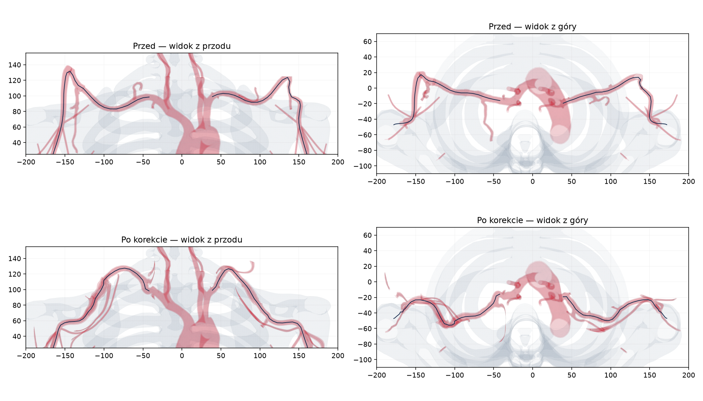

# Bilateral subclavian correction

The old course turned above the lateral shoulder. Both arches now turn closer
to the neck, pass posteriorly toward the costoclavicular space, and descend into
the axillary arteries. Alignment uses the actual transformed skeleton, including
the skeleton parent and vascular rendering offsets. The supplied angiogram is a
reference for the course, not a patient-specific 3D reconstruction.

The offline correction transports the vessel wall and outlet landmarks, then
reconstructs the hollow extension junctions and thoracoacromial branches. All
outer volumes are combined before carving the connected lumens. Residual sheets
at the original extension seams are removed from the central passage.

Validation on the installed model:

- Continuous geometric clearance for a 1.667 mm diameter catheter along both
  subclavian/axillary reference paths; the check includes a distance bound between samples.
- Minimum sampled axis-to-wall distance: 1.527 mm; axis-to-bone distance: 5.365 mm.
- One connected centerline tree, 10,553 segments, no cycles, no invalid final
  segments and no severe axis backtracking.
- Both upper limbs retain 23 terminal centerline branches; distal hand/foot and
  head lumen checks pass.
- All 41 recorded outlet closures block the tested central and rim passages
  (3,977 probes). The reconstructed shoulder branch terminals remain closed.
- All six existing anatomy test scripts and the nine alignment/closure tests pass.
- Production build passes; the corrected model loads in the browser without console errors.

The STL and collision field have matching source hashes; the collision field
occupies 61.67 MiB decoded. Reproduction uses the pinned source revision and
landmarks in `scripts/anatomy/subclavian-landmarks.json`, with
`scripts/align-subclavian-arteries.mjs` followed by the collision builder.

Recorded solver replays with triangle indices belong to their original STL and
must be recaptured for the new triangle layout. Solver performance has not been
rebenchmarked as part of this anatomical correction.
